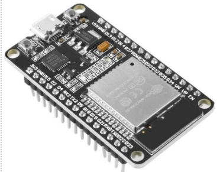
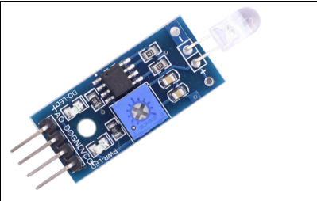
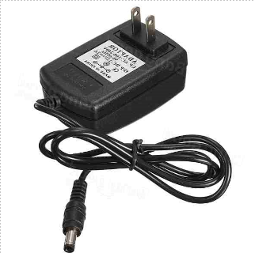

# Devices in Use
ESP32 Wroom devkit v1.



Stepper Motor: 
- NEMA 17 size 42x48 mm.
- Rated Current: 1.5 A.
- Holding Torque: 0.55 Nm, Step Angle: 1.8 degrees.


Stepper Motor Driver: A4988.
- Logic Voltage: 3V-5.5V.
- Output Power up to 35V, Peak Current 2A.


LDR sensor: 3 pieces.



Power Supply.
- 12V-2A-24W Power Adapter.
- Input: 100-240V AC 50/60Hz.
- Output: 12V 2A.


# Smart Curtain Functionality
Informing Users about Room Status via the "inform" topic (publish).
```json
{
    "indoor": 250,
    "outdoor": 300,
    "ledState": true,
    "percent": 50
}
```
Users can control the curtain manually, open or close it at will, or set the curtain to auto mode by Pub/Sub to the following topics.
- auto_requests (subcribe)
```json
{
    "auto_status": true,
    "correlation_data": "123" 
}
```
- auto_responses (publish)
```json
{
    "auto_status": true,
    "correlation_data": "123"
}
```
- handle_requests (subcribe)
```json
{		
    "percent": 50,
    "correlation_data": "456"
}
```
- handle_responses (publish)
```json
{
    "auto_status": true,
    "correlation_data": "456"
}
```
Users receive notifications whenever the curtain loses connection with the broker through the "esp32_status" topic (publish).
```json
{
    "activate": true
}
```
# If you don't have devices, you can use this simulation link
This [Simulation Link](https://wokwi.com/projects/388457419407634433) using my HiveMq free as the broker to transfer message. Change it to your own broker if it doesn't work.
Cons: Auto mode cannot be implemented; only the handle mode is available.